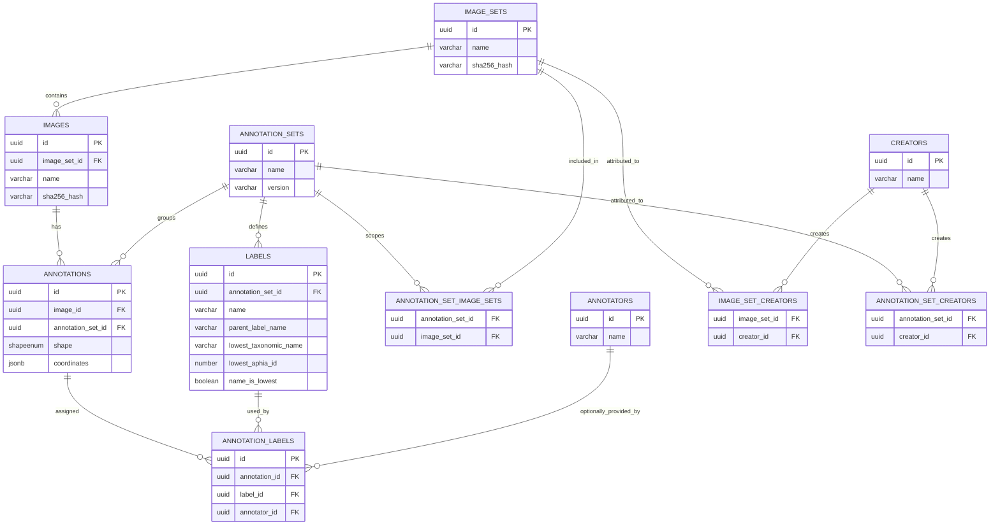

# Image Annotation Database Model

This document describes the core data model for **image collections** and **image annotations**, focusing on:

* `image_sets`
* `images`
* `annotation_sets`
* `annotations`
* `labels`

Supporting join tables included where relevant:

* `annotation_set_image_sets`
* `annotation_labels`

---

## Table of contents

* [Overview](#overview)
* [Core entities](#core-entities)
  * [image_sets](#image_sets)
  * [images](#images)
  * [annotation_sets](#annotation_sets)
  * [annotations](#annotations)
  * [labels](#labels)
* [Join tables](#join-tables)
  * [annotation_set_image_sets](#annotation_set_image_sets)
  * [annotation_labels](#annotation_labels)
* [Cardinality and relationship summary](#cardinality-and-relationship-summary)
* [ER diagram](#er-diagram)

---

## Overview

The model separates **image acquisition/organization** from **annotation releases**:

* **Image Sets** (`image_sets`) group images collected together (mission/survey/event).
* **Images** (`images`) are individual records belonging to exactly one image set.
* **Annotation Sets** (`annotation_sets`) represent a versioned annotation “release”:

  * which image sets are in scope,
  * which annotations were produced,
  * which label vocabulary applies,
  * and who created/curated it.
* **Annotations** (`annotations`) are geometric marks on a specific image.
* **Labels** (`labels`) are the controlled vocabulary scoped to an annotation set.
* **Annotation Labels** (`annotation_labels`) store label assignments to annotations, with optional annotator and confidence.

---

## Core entities

### `image_sets`

**Purpose**
A collection of images (e.g., deployment, transect, event) with shared metadata such as spatial bounds, time, sensor/platform context, and camera calibration information.

**Primary key**

* `id` (uuid)

**Notable constraints**

* `name` is unique
* `sha256_hash` is unique

**Relationships**

* **1-to-many:** `image_sets (1) → (N) images`

  * `images.image_set_id` (NOT NULL) → `image_sets.id`
* **many-to-many:** `image_sets (N) ↔ (N) annotation_sets` via `annotation_set_image_sets`

  * expresses which annotation releases cover a given image set

---

### `images`

**Purpose**
Individual image records. Many metadata fields overlap with `image_sets` to allow per-image overrides (e.g., slightly different positions/timestamps or calibration values).

**Primary key**

* `id` (uuid)

**Notable constraints**

* `name` is unique
* `sha256_hash` is unique

**Relationships**

* **many-to-1:** `images (N) → (1) image_sets`

  * `images.image_set_id` (NOT NULL) → `image_sets.id`
* **1-to-many:** `images (1) → (N) annotations`

  * `annotations.image_id` (NOT NULL) → `images.id`

---

### `annotation_sets`

**Purpose**
A named, versioned annotation release/campaign. An annotation set defines:

* the collection of annotations produced under that release,
* the label vocabulary used,
* which image sets are in scope,
* and who created/curated it (via creators).

**Primary key**

* `id` (uuid)

**Notable constraints**

* `name` is unique

**Relationships**

* **1-to-many:** `annotation_sets (1) → (N) annotations`
  * `annotations.annotation_set_id` → `annotation_sets.id`
* **1-to-many:** `annotation_sets (1) → (N) labels`
  * `labels.annotation_set_id` → `annotation_sets.id`
* **many-to-many:** `annotation_sets (N) ↔ (N) image_sets` via `annotation_set_image_sets`
  * defines the image-set scope of the release
  * attribution/curation metadata

---

### `annotations`

**Purpose**
A geometric markup on an image (bounding box, polygon, point, etc.) stored as `shape` + `coordinates`.

**Primary key**

* `id` (uuid)

**Core fields**

* `image_id` (uuid, NOT NULL): the annotated image
* `shape` (shapeenum, NOT NULL): geometry type
* `coordinates` (jsonb, NOT NULL): geometry payload
* `annotation_set_id` (uuid, nullable): annotation release that the annotation belongs to

**Relationships**

* **many-to-1:** `annotations (N) → (1) images`

  * `annotations.image_id` → `images.id`
* **many-to-1:** `annotations (N) → (1) annotation_sets`
  * `annotations.annotation_set_id` → `annotation_sets.id`
* **many-to-many:** `annotations (N) ↔ (N) labels` via `annotation_labels`
  * an annotation can be assigned multiple labels; labels can appear on many annotations

---

### `labels`

**Purpose**
Controlled vocabulary used for labeling annotations. Labels are *scoped to* an annotation set, enabling different releases to use different label sets or versions.

**Primary key**

* `id` (uuid)

**Notable constraints**

* `name` is unique

**Core fields**

* `name` (varchar)
* `parent_label_name` (varchar): label grouping/category
* taxonomy fields (`lowest_taxonomic_name`, `lowest_aphia_id`, `name_is_lowest`, etc.)
* `annotation_set_id` (uuid, NOT NULL): owning annotation set / vocabulary

**Relationships**

* **many-to-1:** `labels (N) → (1) annotation_sets`
  * `labels.annotation_set_id` → `annotation_sets.id`
* **many-to-many:** `labels (N) ↔ (N) annotations` via `annotation_labels`

---

## Join tables

### `annotation_set_image_sets`

**Purpose**
Defines which image sets are in scope for a given annotation set (and supports multi-release per image set).

**Primary key**

* composite: (`annotation_set_id`, `image_set_id`)

**Foreign keys**

* `annotation_set_id` → `annotation_sets.id` (**ON DELETE CASCADE**)
* `image_set_id` → `image_sets.id` (**ON DELETE CASCADE**)

**Meaning**

* One annotation release can cover many image sets.
* One image set can have many annotation releases (versions, teams, label schemes).

---

### `annotation_labels`

**Purpose**
Stores label assignments to annotations, with optional annotator and confidence.

**Primary key**

* `id` (uuid)

**Foreign keys**

* `annotation_id` (NOT NULL) → `annotations.id` (**ON DELETE CASCADE**)
* `label_id` (NOT NULL) → `labels.id` (**ON DELETE CASCADE**)
* `annotator_id` (nullable) → `annotators.id` (**ON DELETE SET NULL**)

**Meaning**

* Supports multi-label annotations and multi-annotator workflows.
* Records confidence and an external `creation_datetime`.

---

## Cardinality and relationship summary

* `image_sets (1) → (N) images`
* `images (1) → (N) annotations`
* `annotation_sets (1) → (N) annotations`
* `annotation_sets (1) → (N) labels`
* `annotation_sets (N) ↔ (N) image_sets` via `annotation_set_image_sets`
* `annotations (N) ↔ (N) labels` via `annotation_labels`

---

## ER diagram

